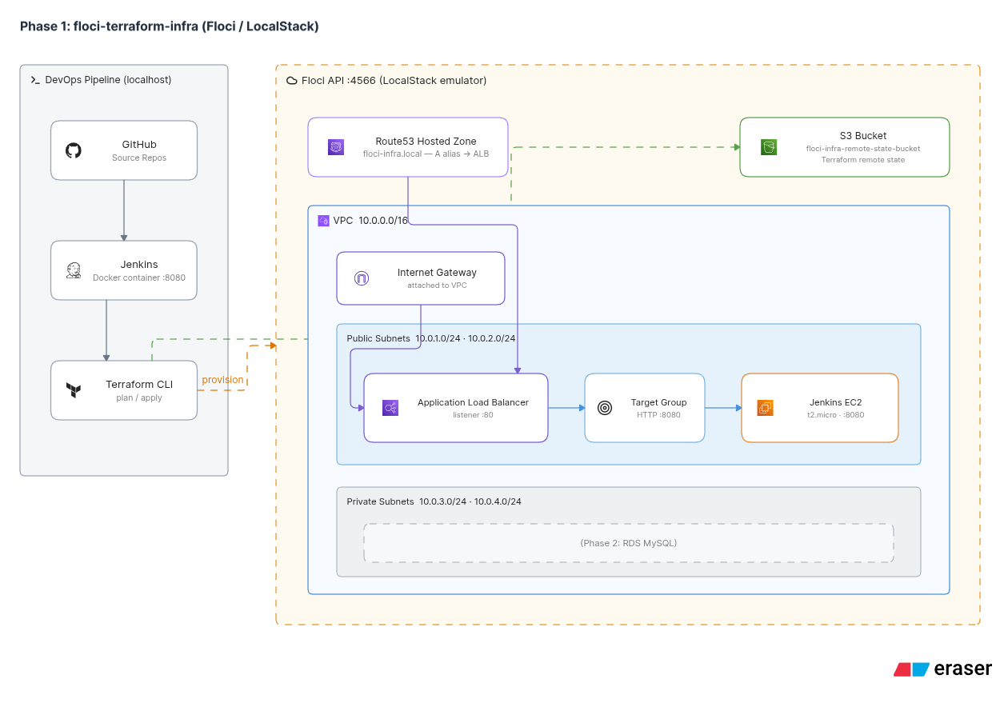

# floci-terraform-infra

**Phase 1 — Local AWS Infrastructure on Floci**

Terraform modules that provision a complete networking + Jenkins stack against **Floci** (LocalStack-compatible AWS emulator running on `localhost:4566`).  
No real AWS account is required. Everything runs locally.

---

## Architecture Overview

```
┌─────────────────────────────────────────────────────────────────────────────┐
│                    PHASE 1: FLOCI LOCAL EMULATOR (API :4566)                │
│                                                                             │
│  Route53: floci-infra.local                                                 │
│       │                                                                     │
│       ▼                                                                     │
│  ┌───────────────────────────────────────────────────────────────────────┐  │
│  │  VPC  10.0.0.0/16                                                     │  │
│  │                                                                       │  │
│  │  Public Subnets (10.0.1.0/24, 10.0.2.0/24)                            │  │
│  │  ┌──────────────┐    ┌──────────────┐    ┌─────────────────────────┐  │  │
│  │  │ Internet GW  │───▶│ ALB (Port 80)│───▶│ Jenkins EC2 (Port 8080) │  │  │
│  │  └──────────────┘    └──────────────┘    └─────────────────────────┘  │  │
│  │                                                                       │  │
│  │  Private Subnets (10.0.3.0/24, 10.0.4.0/24)                           │  │
│  │  (isolated – ready for Phase 2 RDS)                                   │  │
│  └───────────────────────────────────────────────────────────────────────┘  │
│                                                                             │
│  S3: floci-infra-remote-state-bucket  ← Terraform remote state              │
└─────────────────────────────────────────────────────────────────────────────┘

DevOps flow (localhost):
GitHub → Jenkins (Docker :8080) → Terraform CLI → Floci (:4566)
```

> **Visual diagram** (AWS-style icons) is generated from the Mermaid / Eraser / draw.io sources in the [Diagram](#diagram) section below.  
> After generating the image, save it as `docs/architecture.png` and it will appear here:



---

## What This Repo Provisions

| Component              | Resource(s)                                      | Module                    |
|------------------------|--------------------------------------------------|---------------------------|
| VPC + Subnets          | 1 VPC, 2 public, 2 private subnets               | `networking/`             |
| Internet Gateway       | IGW + public route table (0.0.0.0/0)              | `networking/`             |
| Security Groups        | SSH/HTTP/HTTPS + Jenkins 8080                    | `security-groups/`        |
| Jenkins EC2            | t2.micro + key pair + user-data script           | `jenkins/`                |
| Target Group           | HTTP health-check on `/login` → port 8080        | `load-balancer-target-group/` |
| Application Load Balancer | Internet-facing ALB, listener port 80         | `load-balancer/`          |
| Route53                | Hosted zone `floci-infra.local` + alias record   | `hosted-zone/`            |
| Remote State           | S3 backend on Floci                              | `remote_backend_s3.tf`    |

---

## Project Structure

```
floci-terraform-infra/
├── networking/                     # VPC, subnets, IGW, route tables
│   └── main.tf
├── security-groups/                # EC2 + Jenkins security groups
│   └── main.tf
├── jenkins/                        # EC2 instance + key pair
│   └── main.tf
├── jenkins-runner-script/          # User-data install script (documentation)
│   └── jenkins-installer.sh
├── load-balancer-target-group/     # Target group + attachment
│   └── main.tf
├── load-balancer/                  # ALB + HTTP listener
│   └── main.tf
├── hosted-zone/                    # Route53 zone + A-record alias
│   └── main.tf
├── main.tf                         # Root module composition
├── provider.tf                     # AWS provider → Floci endpoints
├── remote_backend_s3.tf            # S3 remote state backend
├── variables.tf
├── terraform.tfvars.example        # Safe-to-commit example values
├── outputs.tf
└── .gitignore
```

---

## Prerequisites

1. **Floci** running and healthy  
   ```bash
   cd ~/projects/floci-ui
   docker compose ps          # all containers Up/healthy
   ```

2. **AWS CLI** configured for local use  
   ```bash
   alias awslocal='aws --endpoint-url=http://localhost:4566'
   ```

3. **Terraform** ≥ 1.5

4. **SSH key** (generated once)  
   ```bash
   ssh-keygen -t ed25519 -f ~/.ssh/floci_infra_key -N ""
   ```

---

## Quick Start

### 1. Clone & configure

```bash
git clone <your-repo-url> floci-terraform-infra
cd floci-terraform-infra

cp terraform.tfvars.example terraform.tfvars
# Edit terraform.tfvars and paste your public key:
# public_key = "$(cat ~/.ssh/floci_infra_key.pub)"
```

### 2. Create the remote-state bucket (one-time)

```bash
awslocal s3 mb s3://floci-infra-remote-state-bucket
awslocal s3 ls
```

### 3. Init → Plan → Apply

```bash
terraform init
terraform plan
terraform apply -auto-approve
```

Expected resources (approximate):

- 1 VPC  
- 4 Subnets  
- 1 Internet Gateway  
- 2 Route Tables + 4 Associations  
- 2 Security Groups  
- 1 Key Pair + 1 EC2 Instance  
- 1 Target Group + 1 Attachment  
- 1 ALB + 1 Listener  
- 1 Route53 Zone + 1 Record  

---

## Key Design Decisions

| Decision | Reason |
|----------|--------|
| HTTP-only ALB (no ACM/HTTPS) | Avoids circular dependency between ALB ↔ ACM ↔ Route53 that appears with LocalStack/Floci |
| `lifecycle { ignore_changes = [associate_public_ip_address] }` on EC2 | Floci always returns `false` for this attribute; without the ignore the instance is force-replaced on every apply |
| Both `elasticloadbalancing` **and** `elasticloadbalancingv2` endpoints | Required by the AWS provider for classic vs. v2 (ALB/TG) resources |
| Private subnets exist but have no NAT | Matches the tutorial intent – private tier is reserved for Phase 2 RDS |
| Remote state in Floci S3 | Keeps the entire stack fully local and reproducible |

---

## Useful Commands

```bash
# Refresh state against Floci
terraform refresh

# Show outputs
terraform output

# Destroy everything
terraform destroy -auto-approve

# Inspect resources directly in Floci
awslocal ec2 describe-instances
awslocal elbv2 describe-load-balancers
awslocal route53 list-hosted-zones
```

---

## Phase 2 (next)

The companion repository `flask-mysql-api` will:

- Deploy a Flask REST API into the private subnets  
- Provision an RDS MySQL instance (also on Floci)  
- Wire a Jenkins pipeline (real Docker container on localhost) that runs `terraform apply` against this infrastructure  

---

## License

MIT
